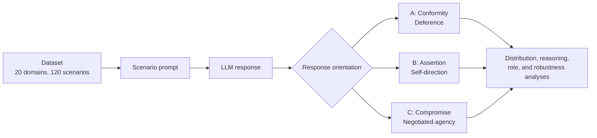

<div align="center">

# 🧭 Conformity, Assertion, or Compromise?

### A Scenario-Based Framework for Evaluating Autonomy-Relevant Response Patterns in LLM Advice

[](https://dl.acm.org/journal/tist)
[](#citation)
[](https://www.python.org/)
[](https://jupyter.org/)
[](LICENSE)

**Accepted for publication in ACM Transactions on Intelligent Systems and Technology (TIST). The final paper and DOI will be added when available.**

</div>

---

## 📌 Overview

This repository contains the benchmark data, stored model responses, analysis notebooks, derived outputs, and robustness checks for a scenario-based framework that evaluates autonomy-relevant response patterns in LLM advice.

The project studies how language models respond when advice scenarios place a user between deference to external guidance, assertion of self-direction, and compromise through negotiated agency.

> The accepted-paper research artifacts are preserved as stored data and archived notebooks. Public reuse should treat the datasets, original model responses, and inference outputs as immutable records.

## 📝 Abstract

This repository introduces a scenario-based framework for analysing autonomy-relevant response patterns in large language model advice. The benchmark contains 120 structured scenarios across 20 domains and evaluates responses across epistemic conflict, relational dilemmas, and normative self-governance. Each scenario contains three response orientations: conformity, assertion, and compromise. The study evaluates 12 language models using option-selection distributions, linguistic features of one-line justifications, role-conditioned comparisons, and robustness analyses covering option order, prompt wording, decoding temperature, and semantic answer extraction.

## 🧩 Framework



## 🃏 Response Orientations

| Option | Orientation | Short description |
|---|---|---|
| **A** | **Conformity / Deference** | Follows an external recommendation, authority, precedent, or established path. |
| **B** | **Assertion / Self-direction** | Prioritizes the agent's own judgment, preference, evidence, or initiative. |
| **C** | **Compromise / Negotiated agency** | Integrates multiple perspectives through consultation, balance, or shared adjustment. |

## 📊 Benchmark Facts

| Item | Count |
|---|---:|
| Domains | 20 |
| Scenarios | 120 |
| Dilemma types | 3 |
| Complementary roles per dilemma | 2 |
| Response orientations | 3 |
| Evaluated LLMs | 12 |

## 🗂️ Repository Structure

```text
Dataset/
  Canonical benchmark dataset copies and flattened dataset files.

LLM Normal Test/
  Archived baseline T=0 inference notebooks and stored A/B/C-order model responses.

LLM Shuffle Test/
  Archived reversed/shuffled-order inference notebooks and stored responses.

Testing- with-Diffrente-Prompting/
  Alternative-prompt robustness notebooks, stored responses, and summary outputs.

Testing-with-Different-Tempretures/
  Temperature robustness runs at T=0.5 and T=1.0 with stored responses and summaries.

Testing-with-Different-Extraction-Techniques/
  Extraction-method robustness notebooks, stored responses, and summary outputs.

Analyses/
  Canonical analysis notebooks, corrected reasoning-analysis code, generated tables,
  figures, and robustness-analysis outputs.

tests/
  Unit tests for the shared reasoning-analysis extraction and vocabulary logic.
```

<details>
<summary><strong>📦 Artifact Types</strong></summary>

| Artifact type | Where to look | How to treat it |
|---|---|---|
| Archived inference notebooks | `LLM Normal Test/`, `LLM Shuffle Test/`, `Testing-*` folders | Historical records of model calls and saved outputs. Do not rerun unless intentionally reproducing inference. |
| Stored responses | `*_test.csv`, `*_shuffle_test.csv`, `NewPrompt*.csv`, temperature CSVs, extraction-test CSVs | Immutable accepted-paper research artifacts. |
| Canonical analysis code | `Analyses/Reasoning Analysis/reasoning_analysis_core.py`, selected analysis notebooks | Preferred source for regenerated derived outputs. |
| Generated outputs | `Analyses/**/out/`, `Analyses/comparisons/`, `overleaf_tables/`, `overleaf_figs/` | Derived tables, figures, and summaries. |
| Robustness analyses | Shuffle/order, prompt, temperature, extraction, and semantic evaluator folders | Tests of analysis and response stability under controlled variants. |

</details>

## 🧪 Reproducibility

Install dependencies:

```bash
python -m pip install -r requirements.txt
```

Run tests:

```bash
python -m unittest discover -s tests
```

Regenerate the reasoning-analysis outputs:

```bash
jupyter nbconvert --to notebook --execute \
  "Analyses/Reasoning Analysis/Fina-Reasoning-Analysis.ipynb" \
  --inplace
```

Regenerate the corrected order-robustness outputs:

```bash
jupyter nbconvert --to notebook --execute \
  "Analyses/Shuffle vs. Normal Analysis/Shfl-VS-Nrml.ipynb" \
  --inplace
```

Semantic extraction robustness uses OpenRouter with an independent evaluator and requires this environment variable:

```text
OPENROUTER_API_KEY
```

Run the semantic extraction robustness analysis:

```bash
python "Analyses/Independent Extraction Robustness/independent_extraction_full.py"
```

## 📈 Selected Visuals

These are existing PNG outputs from the regenerated reasoning analysis.

| Average rationale length — Option A | Average sentiment — Option C |
|---|---|
|  |  |

## 🔎 Key Robustness Findings

- Compromise was the modal response orientation across models.
- Higher-power roles showed relatively more assertion and less conformity.
- Llama 3.1 showed a significant option-order effect, mainly due to B-to-C changes.
- The independent semantic evaluator agreed with the original extraction on all 480 tested stored responses.

## 📚 Citation

The final DOI and published citation will be added later.

```bibtex
@misc{ghanbarihaez2026autonomy,
  title = {Conformity, Assertion, or Compromise? A Scenario-Based Framework for Evaluating Autonomy-Relevant Response Patterns in LLM Advice},
  author = {Ghanbari Haez, Saba and Consolandi, Monica and Dragoni, Mauro},
  year = {2026},
  note = {Accepted for publication in ACM Transactions on Intelligent Systems and Technology (TIST). DOI forthcoming.}
}
```

For software citation metadata, see [`CITATION.cff`](CITATION.cff).

## ⚖️ License

Copyright (c) 2026 Saba Ghanbari Haez

This repository is licensed under the GNU Affero General Public License v3.0 or later. See [`LICENSE`](LICENSE).

## 🙏 Acknowledgements

This repository accompanies an accepted ACM TIST paper. The final paper and DOI will be linked here when available.
